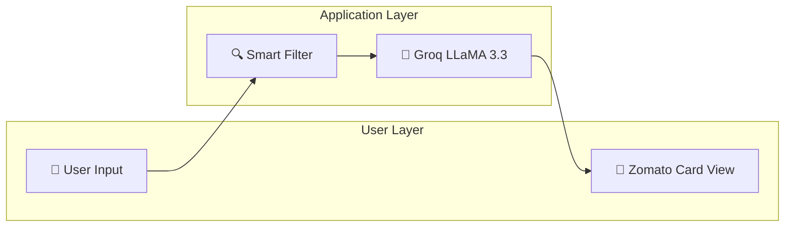
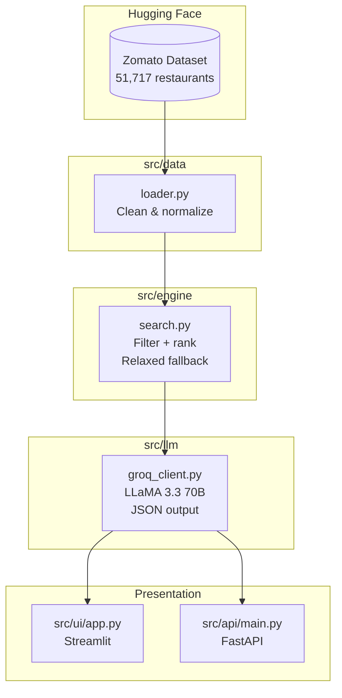

# System Architecture — AI Restaurant Recommendations

A 4-layer system: **Data → Engine → LLM → UI**, with an optional REST API for headless access.

---

## User Journey



1. **User selects** cuisine, location, budget, and minimum rating.
2. **Smart Filter** narrows 51,000+ restaurants to a ranked shortlist.
3. **Groq LLaMA 3.3 70B** generates personalized AI insights per candidate.
4. **Card View** renders results with ratings, dishes, and vibe descriptions.

---

## Data Flow



---

## Component Reference

| Component | File | Responsibility |
|---|---|---|
| **Data Loader** | `src/data/loader.py` | Load HF dataset into DataFrame. Clean `rate` (strip `/5`), `approx_cost` (remove commas), fill missing cuisines |
| **Search Engine** | `src/engine/search.py` | Filter by location, cuisine, budget, rating. Relaxed fallback: broaden to city-wide or ±50% budget if <3 results. Rank by `rating × log(1 + votes)` |
| **LLM Client** | `src/llm/groq_client.py` | Build prompt, call Groq API (`llama-3.3-70b-versatile`, `temp=0.3`), parse structured JSON response |
| **REST API** | `src/api/main.py` | FastAPI `/recommend` endpoint. Exposes the full pipeline as a stateless REST service |
| **UI** | `src/ui/app.py` | Streamlit app. `st.selectbox` for Location, `st.multiselect` for Cuisine. Renders AI Insight cards with `#E23744` accents |

---

## Search Relaxation Strategy

If strict filtering returns fewer than 3 restaurants, the engine runs two parallel relaxations and merges:

```
Strict match       → location exact + cuisine + budget + rating
Relaxed (city)     → broaden to full city (vs neighborhood)
Relaxed (budget)   → allow up to 1.5× user budget
Final set          → union of relaxed sets, deduplicated, ranked
```

---

## LLM Prompt Design

- **System role:** "Respond ONLY with valid JSON using the recommendation schema."
- **User prompt:** Structured block of user preferences + candidate restaurant list.
- **Output schema:**
```json
{
  "recommendations": [
    {
      "name": "Restaurant Name",
      "why_it_fits": "Personalized reason for this user",
      "suggested_dishes": ["Dish A", "Dish B"],
      "vibe": "Casual, rooftop, great for dates"
    }
  ]
}
```
- **Model:** `llama-3.3-70b-versatile` | **Temperature:** `0.3` | **Format:** `json_object`

---

## Caching & Performance

| Mechanism | Where | Effect |
|---|---|---|
| `@st.cache_data` | `src/ui/app.py` | Dataset loaded once per session; no repeat HF calls |
| Local HF cache | `./hf_cache/` | Dataset cached to disk; avoids download on restart |
| LLM lazy client | `src/llm/groq_client.py` | Groq client created per-call; stateless and thread-safe |

---

## Deployment

### Local (Streamlit)
```bash
python -m streamlit run src/ui/app.py
```

### Local (FastAPI)
```bash
uvicorn src.api.main:app --reload --port 8000
```
