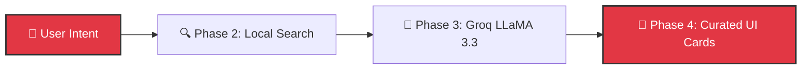

# Architecture Vision — AI Restaurant Recommendations

*Empowering users to find the perfect meal through hyper-personalized, AI-driven discovery.*

---

## 🚀 The Product Strategy
We are moving beyond standard keyword filters ("Italian, 4 stars"). Our goal is to connect users with the right restaurant by combining lightning-fast data retrieval with generative AI that explains *why* a place fits their exact mood and budget.

To execute this, we have deliberately designed the application in four decoupled phases. This modularity ensures our engineering teams can iterate, scale, and test independently.

---

## 🧩 Core Platform Architecture

Our architecture follows a clean, 4-phase pipeline (Data → Search → GenAI → Application) designed for reliability and speed.

### Phase 1: Data Preparation (`Phase_1_Data/`)
**Goal:** Ingest and normalize raw restaurant supply.
- We pull a 50k+ restaurant catalog from the Zomato Hugging Face dataset.
- The loader cleans pricing, ratings, and missing cuisines at startup, caching the results to avoid upstream latency.

### Phase 2: Core Search Engine (`Phase_2_Search/`)
**Goal:** Millisecond-level candidate retrieval.
- When a user searches, we don't send 50k properties to the LLM. Instead, our local search engine instantly filters for exact criteria (location, cuisine, budget, rating).
- **Graceful Degradation:** If we find fewer than 3 matches, the engine automatically broadens the search (e.g., wider city area or 1.5x budget threshold) to ensure the user always gets high-quality recommendations, never a dead end.

### Phase 3: AI Insights Generation (`Phase_3_LLM/`)
**Goal:** Deliver personalized, human-like reasoning.
- The highly-ranked shortlist from Phase 2 is passed to our Generative AI layer.
- We leverage **Groq's LLaMA 3.3 70B** via a fast, structured API.
- The LLM reasons over the candidates and returns a structured JSON payload detailing *exactly why* the restaurant fits the user's specific request, along with curated dish suggestions and vibe checks.

### Phase 4: Full App API & UI (`Phase_4_App/`)
**Goal:** Delight the user.
- **Backend (`api/`):** A stateless FastAPI REST endpoint that exposes the entire pipeline for mobile or headless B2B integrations.
- **Frontend (`ui/`):** A fast, Zomato-inspired Streamlit web app interface designed for zero-friction discovery.

---

## 🔄 User Data Flow

By keeping our architecture in these distinct, well-defined phases, we've positioned ourselves to swap out underlying technologies (like vector databases or new LLM models) without disrupting the core user experience.
