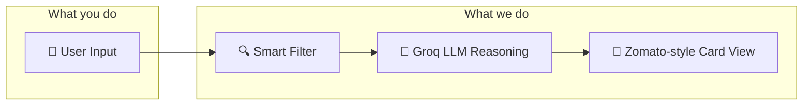
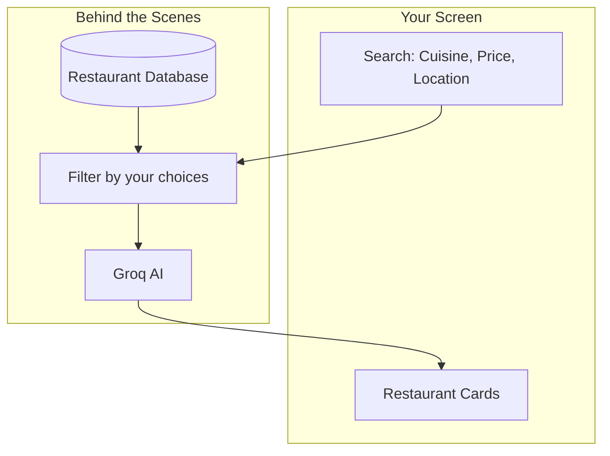

# How It Works — AI Restaurant Recommendations

**In plain language:** You tell us what you want (cuisine, location, budget), we narrow down the best restaurants from a large database, and an AI explains why each place fits you. You see clean, Zomato-style cards with ratings and dish suggestions.

---

## The User Journey



1. **User Input** — You choose cuisine (e.g. Italian), location (e.g. Bangalore), and price range.
2. **Smart Filter** — We quickly filter thousands of restaurants to a short list that matches your criteria.
3. **Groq LLM Reasoning** — An AI picks the best matches and writes a short "why this is for you" for each.
4. **Zomato-style Card View** — You see restaurant cards with name, star rating, AI insight, and recommended dishes.

---

## Data Flow (Simple View)



- Your search goes to a **filter** that looks through the restaurant database.
- The filter keeps only restaurants that match your cuisine, location, and budget.
- The top matches are sent to **Groq AI**, which explains why each fits you.
- You see the results as clean **restaurant cards**.

---

## What Each Part Does

| Part | Purpose |
|------|---------|
| **Data** | Loads and cleans the Zomato dataset so ratings and prices are consistent. |
| **Engine** | Filters restaurants by your choices. If few results, it broadens the search (e.g. whole city). |
| **LLM** | Uses Groq’s `llama-3.3-70b-versatile` model to explain why each restaurant suits you. |
| **API** | Optional backend that other apps can call for recommendations. |
| **UI** | Streamlit app with Zomato-style design (red accents, white background, cards). |

---

## Tech Choices (Non-Technical)

- **Groq** — Fast AI inference so recommendations feel instant.
- **Streamlit** — Lets us build the UI quickly with Python.
- **Hugging Face** — Hosts the Zomato restaurant dataset we use.

---

## File Layout

```
/src
  /data     — Load and clean restaurant data
  /engine   — Search and filter restaurants
  /llm      — Groq AI for recommendations
  /api      — FastAPI backend (optional)
  /ui       — Streamlit web interface

/tests     — Automated tests
/docs      — This document
```
